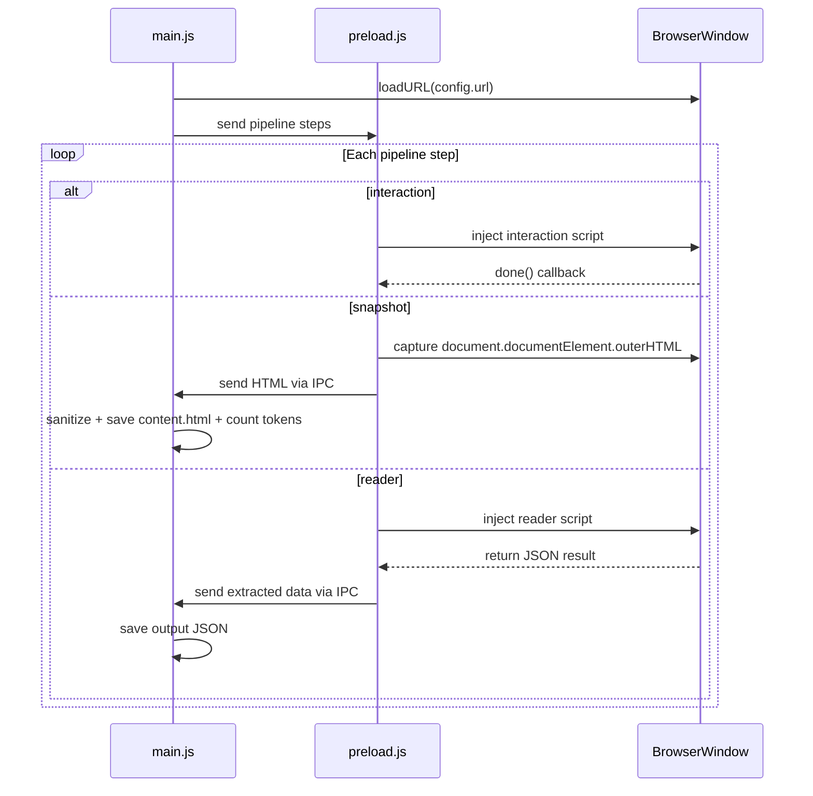

# Extraction Platform Architecture

## Directory Structure

```
apps/data-extractor/
  core/
    registry.js           # Auto-discovers sites from sites/*/config.json
    pipeline-runner.js    # Runs pipeline steps in order via Electron
    snapshot.js           # Captures and sanitizes HTML, counts tokens
    token-counter.js      # Estimates LLM token count for HTML content
  sites/
    pe-no-carnaval/
      config.json         # Pipeline definition + metadata
      content.html        # Sanitized HTML snapshot (generated)
      interactions/
        load-all-events.js
        load-all-events.test.js
      readers/
        extract-events.js       # (existing, moved)
        extract-events.test.js  # (existing, moved)
      writers/               # (empty for now, ready for future use)
  main.js                  # Electron: receives site name, runs pipeline
  preload.js               # Injects pipeline steps into page
```

Rename `readers/` to `sites/` to group all per-site artifacts (interactions, readers, writers, snapshot, config) under one folder.

## config.json per site

```json
{
  "name": "pe-no-carnaval",
  "url": "https://penocarnaval.com.br/programacao/",
  "description": "Carnival events from PE no Carnaval",
  "snapshot": {
    "sanitize": {
      "removeScripts": true,
      "removeStyles": true,
      "removeComments": true,
      "removeSVG": true,
      "removeIframes": true,
      "additionalSelectors": ["header", "footer", ".eventos-filter"]
    }
  },
  "pipeline": [
    { "type": "interaction", "module": "interactions/load-all-events.js" },
    { "type": "snapshot" },
    { "type": "reader", "module": "readers/extract-events.js" }
  ]
}
```

Each step type:

- **interaction**: Injected into the page. Modifies DOM state (clicks, navigates, waits). Must call a `done()` callback when finished.
- **snapshot**: Captures current DOM, sanitizes with `cleanHTML` (using options from config), saves to `content.html`, and writes token estimate to `config.json` metadata.
- **reader**: Receives the document, returns extracted JSON data. Never modifies DOM.
- **writer** (future): Receives the document, modifies DOM nodes, returns nothing. Runs before readers.

## Pipeline Flow




## Key Components

### 1. `core/registry.js`

Scans `sites/*/config.json` and returns a map of available sites. Used by main.js to validate site name and load config.

### 2. `core/pipeline-runner.js`

Receives config + BrowserWindow. Iterates through `pipeline` array, executing each step sequentially via IPC between main process and preload.

### 3. `core/snapshot.js`

- Receives raw HTML string
- Applies `cleanHTML` sanitization (move `[scripts/clean_html.js](scripts/clean_html.js)` into `core/sanitizer.js`, adapted for jsdom since it runs in main process)
- Calls `token-counter.js` to estimate tokens
- Saves `content.html` to the site folder
- Updates `config.json` metadata with `{ tokens: number, snapshotDate: ISO string }`

### 4. `core/token-counter.js`

Simple estimation using char count / 4 (rough GPT tokenizer approximation) or use a lightweight tokenizer lib. Stores result in config metadata:

```json
{
  "metadata": {
    "tokens": 1250,
    "snapshotDate": "2026-02-07T20:00:00Z"
  }
}
```

### 5. Interaction interface

Each interaction module exports a function that receives `document` and a `done` callback:

```javascript
module.exports = function loadAllEvents(document, done) {
  // click "load more" until gone, then call done()
};
```

### 6. Reader interface (unchanged)

```javascript
module.exports = function extractEvents(document) {
  return { events: [...] };
};
```

### 7. Writer interface (future)

```javascript
module.exports = function addMissingFields(document) {
  // modify DOM nodes directly
};
```

### 8. `preload.js`

Becomes a generic pipeline executor. Receives step instructions via IPC from main process, injects the appropriate script into the page, and returns results back via IPC.

### 9. `main.js`

- Receives site name from CLI args: `npm run extract -- pe-no-carnaval`
- Uses registry to load config
- Creates BrowserWindow, loads URL
- Hands off to pipeline-runner
- Saves final output to `sites/{name}/output.json`

## Migration of Existing Code

- Move `[readers/extract-events/extract-events.js](apps/data-extractor/readers/extract-events/extract-events.js)` to `sites/pe-no-carnaval/readers/extract-events.js`
- Move `[readers/extract-events/extract-events.test.js](apps/data-extractor/readers/extract-events/extract-events.test.js)` to `sites/pe-no-carnaval/readers/extract-events.test.js`
- Move `[readers/extract-events/content.html](apps/data-extractor/readers/extract-events/content.html)` to `sites/pe-no-carnaval/content.html`
- Move `[scripts/clean_html.js](scripts/clean_html.js)` to `core/sanitizer.js` (adapt for jsdom)
- Create `sites/pe-no-carnaval/interactions/load-all-events.js` from the old "Carregar mais eventos" logic
- Delete old `readers/` directory

## IPC Communication

- `pipeline:run-step` (main -> renderer): sends step type + module code
- `pipeline:step-done` (renderer -> main): returns step result (HTML for snapshot, JSON for reader, status for interaction)
- `pipeline:log` (renderer -> main): forwards console logs to log window

