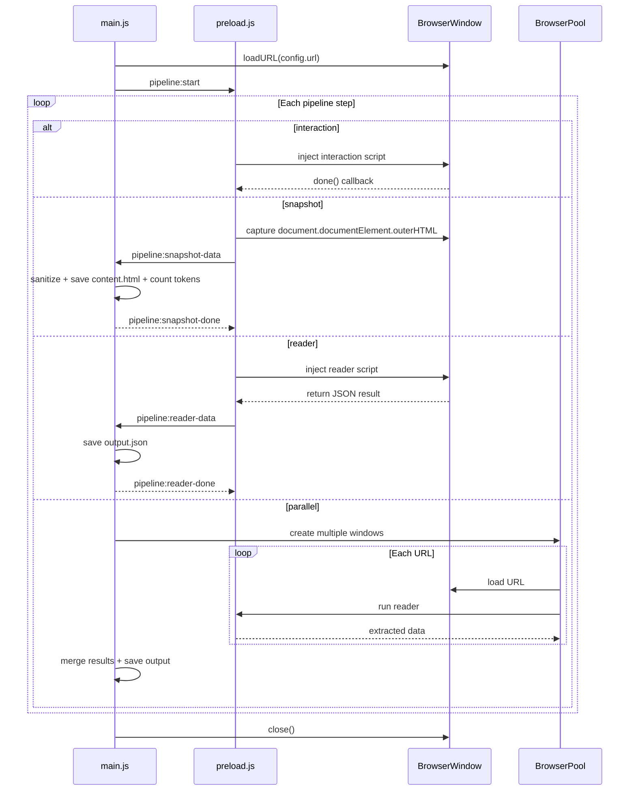

# Extraction Platform Architecture

## Directory Structure

```
apps/data-extractor/
  core/
    registry.js           # Auto-discovers sites from sites/*/config.json
    pipeline-runner.js    # Executes pipeline steps via IPC
    snapshot.js           # Captures and sanitizes HTML, counts tokens
    sanitizer.js          # HTML cleaning utilities
    token-counter.js      # Estimates LLM token count
    browser-pool.js       # Manages browser instances for parallel extraction
  sites/
    pe-no-carnaval/
      config.json         # Pipeline definition + metadata
      content.html        # Sanitized HTML snapshot (generated)
      output.json         # Extracted data
      interactions/
        load-all-events.js
      readers/
        extract-events.js
        extract-event-details.js
      writers/            # (empty for now)
      test/
        __fixtures__/     # Test HTML snapshots
        utils/            # Test utilities
    carnaval-recife-pe-gov-br/
      config.json
      readers/
        extract-list.js
        extract-details.js
      interactions/
      writers/
      test/
  main.js                 # Electron main process
  preload.js              # Pipeline executor (renderer process)
  log-preload.js          # Logging window preload
```

## config.json per site

```json
{
  "name": "pe-no-carnaval",
  "url": "https://penocarnaval.com.br/programacao/",
  "description": "Carnival events from PE no Carnaval",
  "snapshot": {
    "sanitize": {
      "removeScripts": true,
      "removeStyles": true,
      "removeComments": true,
      "removeSVG": true,
      "removeIframes": true,
      "removeHidden": true,
      "additionalSelectors": ["header", "footer", ".eventos-filter"]
    }
  },
  "pipeline": [
    { "type": "interaction", "module": "interactions/load-all-events.js" },
    { "type": "reader", "module": "readers/extract-events.js" },
    {
      "type": "parallel",
      "concurrency": 30,
      "module": "readers/extract-event-details.js",
      "input": "output.json",
      "itemsPath": "events",
      "urlField": "url",
      "output": "output-with-details.json"
    }
  ],
  "metadata": {
    "tokens": 55077,
    "characters": 220328,
    "snapshotDate": "2026-02-07T21:11:50.209Z",
    "estimatedCost": {
      "gpt4": 1.65231,
      "gpt35": 0.0826155,
      "claude": 0.440616
    }
  }
}
```

Each step type:

- **interaction**: Injected into page. Modifies DOM state (clicks, navigates, waits). Must call `done()` callback when finished.
- **snapshot**: Captures current DOM, sanitizes it, saves to `content.html`, and writes token estimate to `config.json` metadata.
- **reader**: Receives document, returns extracted JSON data. Never modifies DOM. Output saved to `output.json`.
- **parallel**: Runs a reader against multiple URLs concurrently. Uses browser pool to parallelize extraction.
- **writer** (not implemented): Would modify DOM nodes before extraction.

## Pipeline Flow



## Key Components

### 1. `core/registry.js`

Scans `sites/*/config.json` and returns a map of available sites. Used by main.js to validate site name and load config.

### 2. `core/pipeline-runner.js`

Executes pipeline steps sequentially via IPC. Handles:
- **interaction**: Injects script into page, waits for `done()` callback
- **snapshot**: Captures HTML, delegates to `snapshot.js` for sanitization and token counting
- **reader**: Injects reader script, saves output to `output.json`
- **parallel**: Creates browser pool, runs reader against multiple URLs concurrently, merges results

### 3. `core/snapshot.js`

- Receives raw HTML string
- Applies sanitization via `sanitizer.js`
- Calls `token-counter.js` to estimate tokens and cost
- Saves `content.html` to site folder
- Updates `config.json` metadata with token count, character count, and estimated costs

### 4. `core/sanitizer.js`

Sanitizes HTML to reduce token count by removing:
- Scripts and styles
- Comments
- SVGs and iframes
- Hidden elements (`display: none`, `visibility: hidden`)
- Custom selectors (configured per site in `additionalSelectors`)

Uses JSDOM for DOM manipulation in Node.js environment.

### 5. `core/token-counter.js`

Estimates LLM token count and cost for sanitized HTML:
- Token estimation: character count / 4 (rough approximation)
- Cost calculation for GPT-4, GPT-3.5, and Claude models
- Results stored in `config.json` metadata

### 6. `core/browser-pool.js`

Manages multiple Electron BrowserWindow instances for parallel extraction:
- Creates pool of browsers based on concurrency setting
- Queues URLs for processing
- Coordinates extraction across multiple pages simultaneously
- Cleans up browser instances after completion

### 7. Interaction interface

Each interaction module exports a function receiving `document` and `done` callback:

```javascript
module.exports = function loadAllEvents(document, done) {
  // Click "load more" until gone, then call done()
  const button = document.querySelector('.load-more');
  if (button) {
    button.click();
    setTimeout(() => loadAllEvents(document, done), 1000);
  } else {
    done();
  }
};
```

### 8. Reader interface

Returns extracted data as JSON:

```javascript
module.exports = function extractEvents(document) {
  const events = Array.from(document.querySelectorAll('.event')).map(el => ({
    title: el.querySelector('h2').textContent,
    date: el.querySelector('.date').textContent
  }));
  return { events };
};
```

### 9. Parallel extraction

Parallel steps extract data from multiple URLs concurrently:

```json
{
  "type": "parallel",
  "concurrency": 30,
  "module": "readers/extract-event-details.js",
  "input": "output.json",
  "itemsPath": "events",
  "urlField": "url",
  "output": "output-with-details.json"
}
```

Reads items from previous output, extracts URL from each item, runs reader against each URL in parallel pool, then merges results.

### 10. `preload.js`

Generic pipeline executor in renderer process:
- Receives step instructions via IPC from main
- Injects scripts into page context
- Returns results via IPC
- Forwards console logs to log window

### 11. `main.js`

Entry point:
- Parses CLI args for site name: `npm run extract -- pe-no-carnaval`
- Uses registry to load config
- Creates main BrowserWindow and log window
- Loads site URL
- Delegates to pipeline-runner
- Handles IPC communication
- Saves final output

## Testing

Each site has a `test/` directory with:
- **`__fixtures__/`**: Saved HTML snapshots for testing
- **`utils/`**: Test utilities (e.g., `load-fixture.js`)
- Test files for readers and interactions

Example test structure:

```javascript
const extractEvents = require('../readers/extract-events');
const { loadFixture } = require('./utils/load-fixture');

describe('extract-events', () => {
  test('extracts event data', () => {
    const doc = loadFixture('events-page.html');
    const result = extractEvents(doc);
    expect(result.events).toHaveLength(10);
  });
});
```

Run tests:
```bash
npm test                # All tests
npm run test:watch      # Watch mode
```

## IPC Communication

Communication between main and renderer processes:

**Interaction steps:**
- `pipeline:run-interaction` (main → renderer): Send interaction code
- `pipeline:interaction-done` (renderer → main): Signal completion

**Snapshot steps:**
- `pipeline:capture-snapshot` (main → renderer): Request HTML capture
- `pipeline:snapshot-data` (renderer → main): Send captured HTML
- `pipeline:snapshot-done` (main → renderer): Signal processing complete

**Reader steps:**
- `pipeline:run-reader` (main → renderer): Send reader code
- `pipeline:reader-data` (renderer → main): Send extracted data
- `pipeline:reader-done` (main → renderer): Signal completion

**Parallel steps:**
- Uses browser pool to create multiple windows
- Each window runs reader independently
- Results aggregated in main process

**Logging:**
- `pipeline:log` (renderer → main): Forward console logs to log window

## CLI Usage

```bash
# Extract from default site (pe-no-carnaval)
npm run extract

# Extract from specific site
npm run extract -- carnaval-recife-pe-gov-br

# Run in headless mode
npm run extract:headless

# Run specific site headless
npm run extract:headless -- pe-no-carnaval
```

